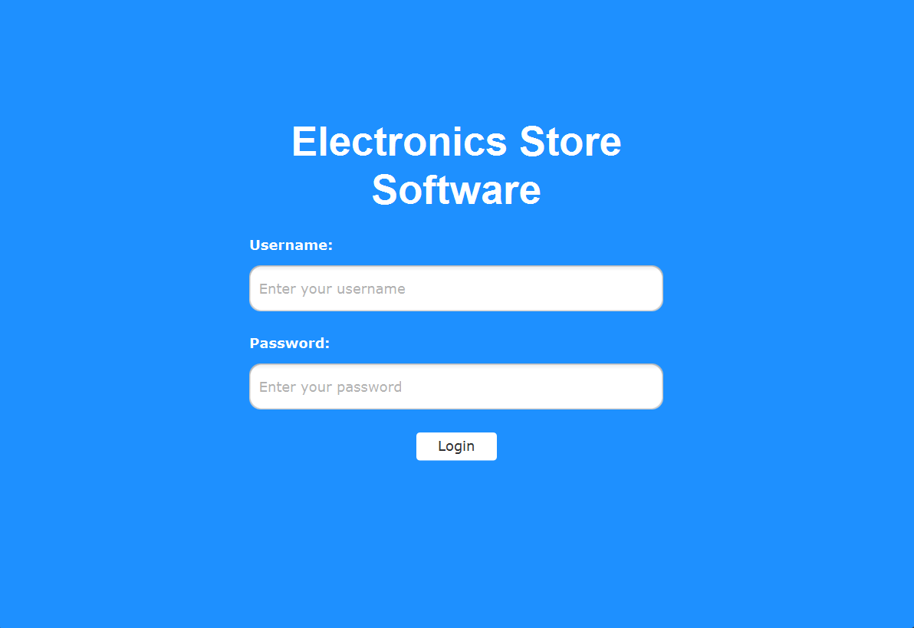
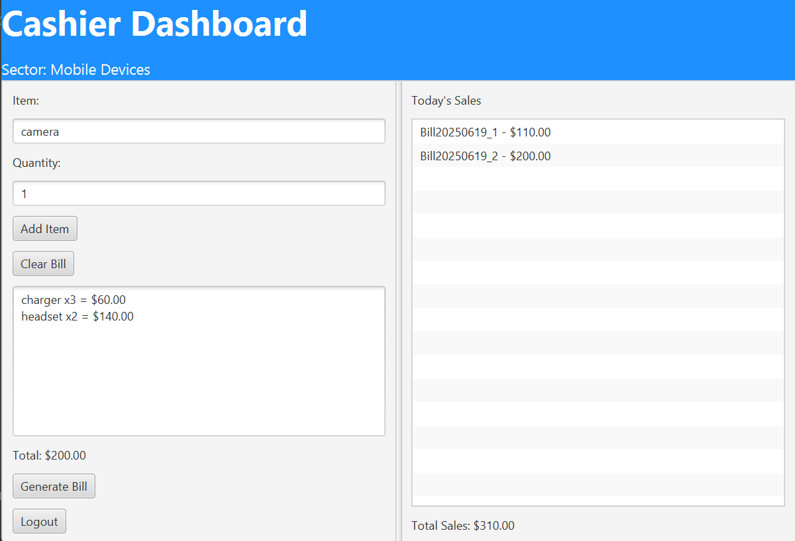
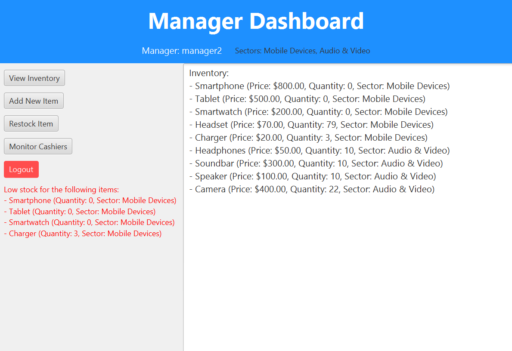
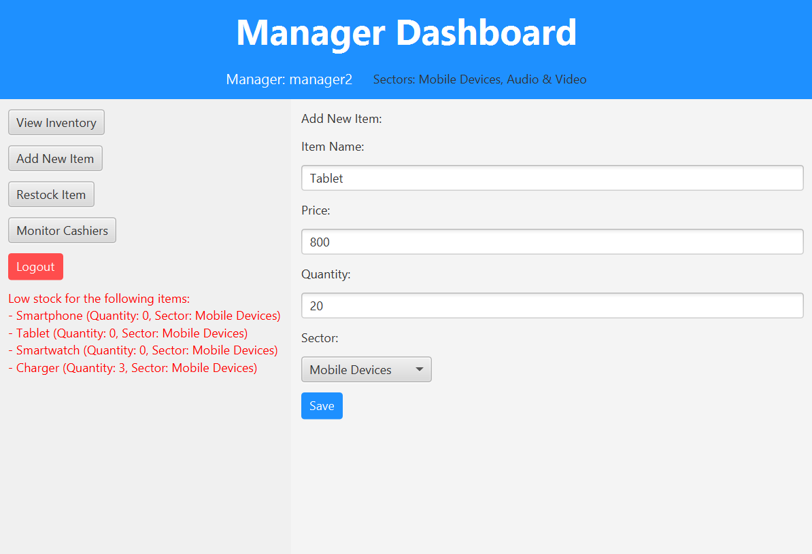
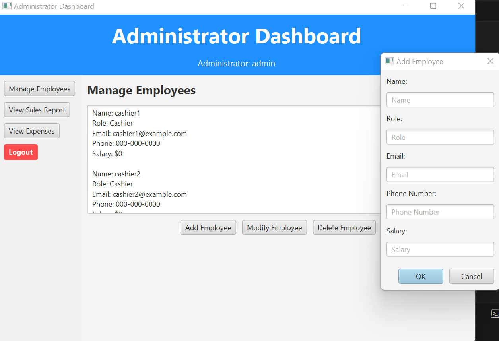

# Electronics Store Management Software — JavaFX Desktop Application

> A desktop application for managing an electronics store, built with **Java**, **JavaFX**, and **Maven**.  
> Includes features for inventory, billing, and employee management — all in a modern GUI.

---

## Tech Stack

- Java 21
- JavaFX 21
- Maven

---

## USERNAMES & PASSWORDS

Below is the list of users with their roles and passwords. Use these to log in to the application:

### Cashiers:
- **Username:** `cashier1`, **Password:** `12345` _(Manages Mobile Devices)_
- **Username:** `cashier2`, **Password:** `12345` _(Manages Computers)_
- **Username:** `cashier3`, **Password:** `12345` _(Manages Audio & Video)_

### Managers:
- **Username:** `manager1`, **Password:** `54321` _(Manages Computers)_
- **Username:** `manager2`, **Password:** `54321` _(Manages Mobile Devices and Audio & Video)_

### Administrator:
- **Username:** `admin`, **Password:** `123` _(Full access to the system)_

---

## HOW TO USE THE SOFTWARE

1. Login:
Use the provided usernames and passwords to log in. Each user sees a dashboard based on their role.

2. Cashier Dashboard:
Add items to a bill using their name and quantity.
Generate and save bills.
View today's bills and total sales.

3. Manager Dashboard:
Restock or add new items to inventory.
Monitor cashier performance and sales statistics.
Receive low-stock notifications.

4. Administrator Dashboard:
Manage employee profiles.
Grant or revoke employee access.
View detailed reports on sales and expenses.

5. Logout:
Click the red "Logout" button to return to the login screen.

---

## FILES
- users.txt: Stores usernames, passwords, and roles
- inventory.txt: Tracks inventory details (name, price, quantity, sector)
- bills/: Directory which stores the bills in txt format

---

## Screenshots

---

## How to Run

### Prerequisites

- JDK 21 (or higher)
- [Apache Maven](https://maven.apache.org/download.cgi)
- JavaFX (added automatically via Maven)

---

### Run the project using Maven
mvn clean javafx:run

